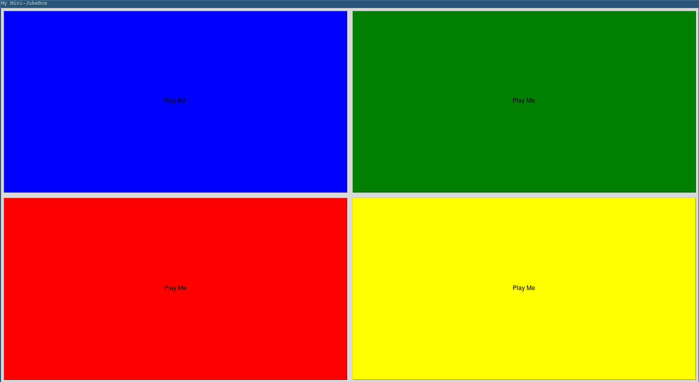

# MY MINI-SOUNDBOX

## Introduction

Pour ce projet nous allons, quitter un peu le monde de l'algorithmie pur et dur, pour découvrir une infime partie de l'interface utilisateur.
Pour cela quoi de mieux que de coder une application très simple mais ludique, je pense bien sûr à une soundbox.

Voici à quoi pourra ressembler votre soundbox, une fois terminé:



Simple, et efficace.

## Les Bibliothèques que nous allons utiliser:

### Interface Graphique:

Avant de commencer tout de suite à coder il va falloir choisir une bibliothèque pour faire une interface graphique (ou GUI en anglais). Pour cela plusieurs modules sont à notre dispositions en python comme TkIntern, Kivy, PyQT, PyGUI, ...

Pour ce projet nous allons utiliser TkIntern car c'est une librairie facile à utilisé avec beaucoup de tutoriels sur internet, notament GeeksforGeeks.

```python
import tkintern
```

### La musique:

Pour jouer de la musique nous allons utiliser le module Playsound, qui est très très simple d'utilisation et surtout crossPlatform car il fonctionne sous Mac, Windows et Linux.

```python
from playsound import playsound
```

### Les threads:

Mais qu'est ce qu'un thread ?

Pour expliquer de manière simple et grossière un thread c'est du code qui va s'éxecuter de manière parallèle à notre programme principale. Attention car notre programme est aussi un thread, c'est le thread principale du processus.

Et donc nous avons besoin des threads car on ne va pas lancer nos sons sur le thread principale, il va donc falloir les lancer sur des threads séparé afin de ne pas bloquer notre application pendant que celle-ci joue nos sons.

Pour utitliser les thread en python nous allons utiliser le module threading:

```python
import threading
```

### Un peu de code:

## Créer une fenêtre:

Vous devrez créer une nouvelle fenêtre que vous appelerez "My Mini-SoundBox" via le module tkintern et la fonction `tk()`.

```python
window = tk.Tk()
```

Attention n'oubliez pas de faire un `window.mainloop()` à la fin de votre code.

### Créer un boutton:

Le corps de la soudbox sont les bouttons, ce sont eux qui veut lancer les sons quand on clique dessus. Voici comment créer un boutton avec tkintern:

```python
button = tk.Button(master = window, text="Click Me", bg="blue",
                   fg="yellow", command = function_to_execute)
```
Comme vous l'avez surement deviné fonction_to_execute est le nom de la fonction qui sera lancé quand l'utilisateur aura cliqué sur le boutton.

Attention il se peut que vous ayez besoin de passer des arguments à votre fonction, pour cela la méthode la plus simple est de passer par une lambda fonction.

### Jouer un peu de musique:

Lancé un fichier son est très facile avec playsound, tout ce dont vous avez besoin c'est du chemin relatif ou absolue menant au fichier que vous voulez exécuter, comme ci:

```python
playsound("path_to_the_file")
```

Or, nous comme nous l'avons vu dit avant, nous allons avoir besoin de thread, car si on lance le son sur le thread principale (celui qui s'occupe de l'affichage de la GUI) celui-ci va freeze pendant tout le son. Et bien sur nous ne voulons pas du tout ce genre de comportement pour notre programme.

Vous devrez donc créer un thread qui excutera de manière parallèle une fonction qui lance le son choisi par l'utilisateur.
Ce thread sera donc la fonction donné au paramètre command pendant la création du boutton.

```python
x = threading.Thread(target=playsound, args(path))
x.start()
```
### Plusieurs Bouttons

Maintenant que nous avons un boutton qui fonctionne et qui lance notre son choisit, nous allons pouvoir en mettre autant que l'on veut.
Pour cela nous avons plusieurs outils mis à dispositions par le module tkinter comme, pack, grid, place.

Parceque nous voulons que les bouttons se disposent en formant une grille et que je trouve que c'est la méthode la plus simple et la plus compréhensible. Nous allons utiliser grid.

L'outil grid permet d'afficher et d'organiser les éléments sous forme de grilles (quelle surprise !), pour celle il suffit de créer un élément d'appeler sa méthode grid comme suivant:

```python
button.grid(row = row_idx, column = column_idx, sticky = N + S + E + W, padx = 5, pady = 5)
```

Ici l'argument sticky va permettre de choisir comment l'élément va réagir quand la fenêtre s'agrandit ou se rétrécit. je vous laisse regarder sur internet pour plus de détail sur cette fonctionalité.

Quand au paramètre pad il s'agit tout simplement du padding (donc de l'espace) horizontal et vertical entre cet élément et les autres.

La méthode conseillé afin que le resize des éléments ce passe correctement est d'utiliser les fonctions **columnconfigure** et **rowconfigure**, de la façon suivante:

```python
tk.Grid.columnconfigure(window, index_elmt, weight = 1)
tk.Grid.rowconfigure(window, index_elmt, weight = 1)
```

Pour cela je vous conseil de créer une frame avec comme index (0, 0) et de configurer les columns et lignes en utilisant les fonctions suivantes. Puis de créer des bouttons qui n'auront pas **window** comme master mais **frame**. (voir argument master à la création de l'élément).

## Bonus:

### Un vrai titre:

Vous pouvez rajouter un vrai titre à votre application, ainsi qu'un petit message de bienvenue, c'est toujours plus conviviable.

### Comment je sors de là ?

Vous pouvez ajouter un boutton pour quitter de manière propre votre application, et qui arrêtera également tous les threads en cours d'exécutions.

### Toc Toc Toc, c'est la police:

Votre son est trop fort, et la police a été prévenu vous allez donc devoir baissez celui-ci. Or, vous avez la flemme de baissez le son sur votre ordinateur, si seulement il y a avait un slider pour le faire directement dans l'application.

# BONNE CHANCE !!!
